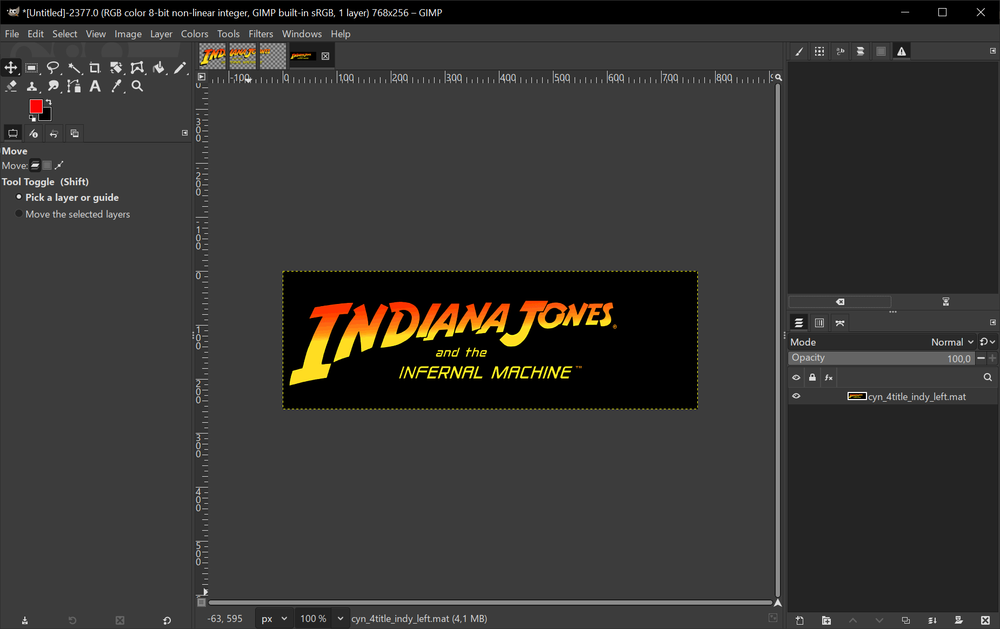
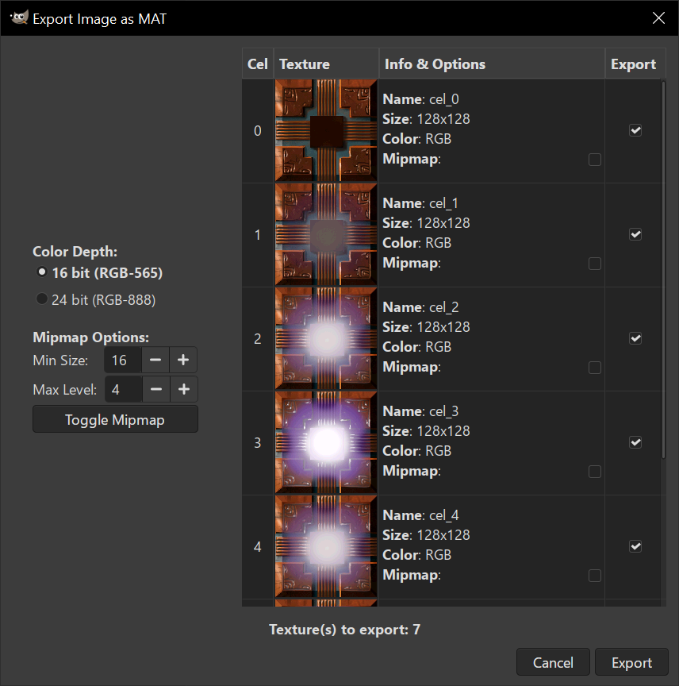

# Indiana Jones and the Infernal Machine plugin for GIMP 3
GIMP 3 plugin for importing/exporting texture files (`.mat`) for the game Indiana Jones and the Infernal Machine.

# Requirements
GIMP 3: [https://www.gimp.org](https://www.gimp.org/)  
In order for plugin to work make sure to install GIMP with **python scripting**.

# Installation
   1. Download the latest `gimp-file-mat.zip` from the [Releases](https://github.com/smlu/gimp-ijim/releases) page or download/clone this repository.
   2. Extract/copy the `file-mat` folder to GIMP's `plug-ins` folder:  
      - **Windows**: `C:\Users\<USERNAME>\AppData\Roaming\GIMP\3.0\plug-ins`  
        *Make sure you have GIMP installed with support for Python scripting.*  

      - **Linux**: `/home/<USERNAME>/.config/GIMP/3.0/plug-ins`  
      - **macOS**: `/Users/<USERNAME>/Library/Application Support/GIMP/3.0/plug-ins`

   *Note: If you can’t locate the `plug-ins` folder, open GIMP and go to Edit > Preferences > Folders > Plug-Ins and use one of the listed folders.*

# Usage
## Importing texture .mat file
To import `.mat` file into GIMP, go to *File > Open* then navigate to the folder containing `*.mat` file, select a file and click *Open*.

## Exporting image as .mat file
To export image as `.mat` image file, in GIMP go to *File > Export As* then navigate to the folder where you want to export file, enter the file name with `*.mat` extension and click *Export*. A new dialog window will open up where you can edit export options.

*Note: If you are planning to use exported texture in the game make sure to limit the length of the file name (including `.mat` extension) to max 64 characters.*
